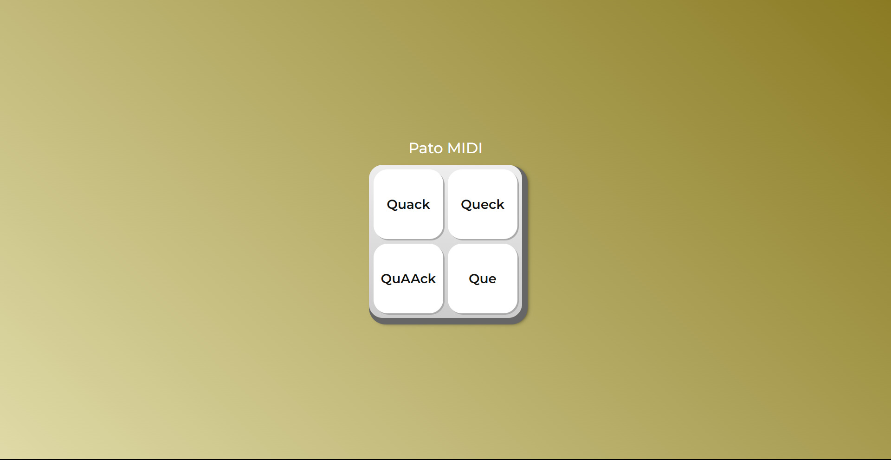

# PatoMIDI

> Um arquivo MIDI com sons de pato é uma forma digital de armazenar informações musicais que reproduzem sons característicos de patos. MIDI, sigla para Interface Digital de Instrumentos Musicais, não armazena áudio real, mas sim dados que controlam dispositivos eletrônicos ou softwares para reproduzir sons. No caso de um MIDI de pato, os dados instruem o dispositivo a gerar sons que imitam os grasnidos típicos dessas aves aquáticas. Esses arquivos são usados em diversas aplicações, desde músicas humorísticas até efeitos sonoros em produções audiovisuais, adicionando uma pitada de diversão e natureza aos projetos musicais e de entretenimento.

### Ajustes e melhorias

O projeto ainda está em desenvolvimento e as próximas atualizações serão voltadas nas seguintes tarefas:

- [x] HTML
- [x] CSS
- [x] JS Function
- [x] JS Improvements
- [x] Github

## 💻 Pré-requisitos

Antes de começar, verifique se você atendeu aos seguintes requisitos:

- Você tem uma navegador `<Chrome / Firefox>`.
- Você tem um sistema operacional `<Windows>`.

## 📫 Contribuindo para <PatoMIDI>

Para contribuir com <PatoMIDI>, siga estas etapas:

1. Bifurque este repositório.
2. Crie um branch: `git checkout -b <nome_branch>`.
3. Faça suas alterações e confirme-as: `git commit -m '<mensagem_commit>'`
4. Envie para o branch original: `git push origin <nome_do_projeto> / <local>`
5. Crie a solicitação de pull.

Como alternativa, consulte a documentação do GitHub em [como criar uma solicitação pull](https://help.github.com/en/github/collaborating-with-issues-and-pull-requests/creating-a-pull-request).

## 🤝 Colaboradores

Agradecemos às seguintes entidades que contribuíram para este projeto:

<table>
  <tr>
    <td align="center">
      <a href="#" title="defina o titulo do link">
         
        
          <b>Gustavo Triaquim</b>
        
      </a>
    </td>
    <td align="center">
      <a href="#" title="defina o titulo do link">
         
        
          <b>Patolino</b>
        
      </a>
    </td>
    <td align="center">
      <a href="#" title="defina o titulo do link">
         
        
          <b>Steve Jobs</b>
        
      </a>
    </td>
  </tr>
</table>

## 😄 Seja um dos contribuidores

Quer fazer parte desse projeto? Clique [AQUI](CONTRIBUTING.md) e leia como contribuir.

## 📝 Licença

Esse projeto está sob licença. Veja o arquivo [LICENÇA](LICENSE.md) para mais detalhes.
